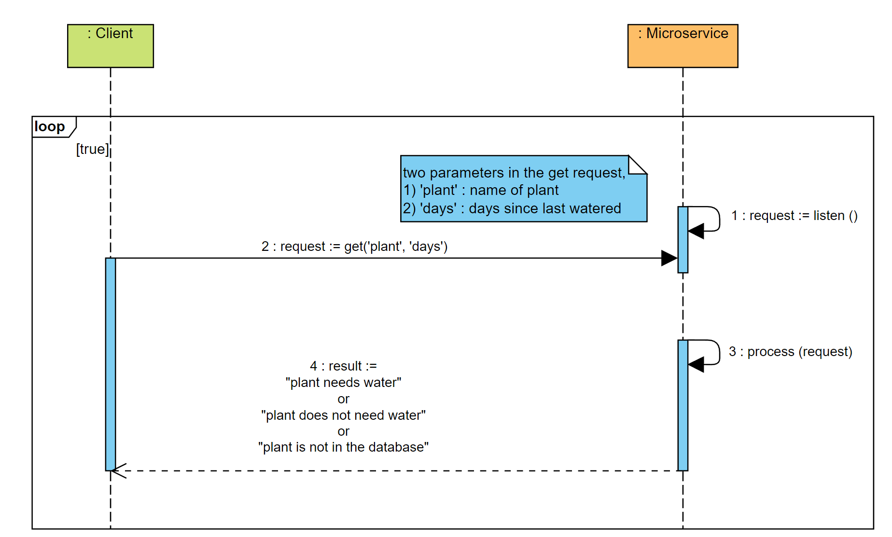

This microservice is for a plant watering reminder app.

To request and receive data, 

1) use the following url:

    url = "http://127.0.0.1:5000/plantwatering"

2) specify two parameters, plant type and days since last watered
   
   params = {'plant': 'fern', 'days': 1}

3) create GET request 

   requests.get(url, params=params)

4) the plant watering microservice will return 3 responses based on parameters from the GET request
   
   a) "plant needs water" if the days since the plant was last watered is greater or equal to the watering requirements
   
   b) "plant does not need water" if the days since the plant was last watered is less than the watering requirements
   
   c) "plant is not in the database" if the plant is not in the watering database

